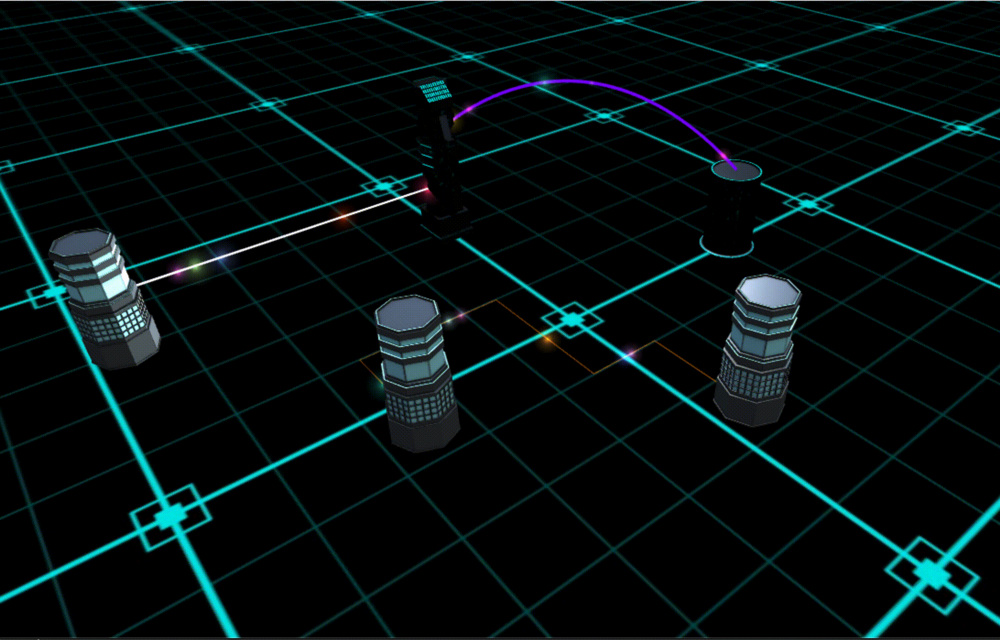

----
[](https://www.npmjs.com/package/three.signal-line)
[](https://codecov.io/gh/tankerxyz/three.signal-line)
[](https://circleci.com/gh/Tankerxyz/three.signal-line/tree/master)
[](https://github.com/tankerxyz/three.signal-line)

# Three.Signal-Line

[three.signal-line](https://www.npmjs.com/package/three.signal-line) is a JavaScript package that provides a signal line component for the popular 3D rendering library, Three.js. It allows you to create animated signal lines in your Three.js scenes with customizable colors, speeds, sizes, and more.

## Features

- **Animated Signal Lines**: Create visually appealing animated signal lines in your Three.js scenes.
- **Customizable Options**: Control the appearance and behavior of signal lines with customizable options such as color, speed, size, opacity, and texture.
- **Backward Movement**: Choose whether the signal lines move forward or backward along their paths.
- **Texture Support**: Apply textures to signal lines for enhanced visual effects.
- **Smooth Animation**: Signal lines smoothly transition between points, creating fluid animations.
- **Easy Integration**: The package integrates seamlessly with Three.js, making it easy to incorporate signal lines into your existing Three.js projects.

## The package also have nice some things:

* Backwards compatibility for Node.js-style (CommonJS) imports
* Both strict and flexible [typescript configurations](config/tsconfig.json) available
* Collocated, atomic, concurrent unit tests with [AVA](https://github.com/avajs/ava)
* Source-mapped code coverage reports with [nyc](https://github.com/istanbuljs/nyc)
* Configurable code coverage testing (for continuous integration)
* Automatic linting and formatting using [TSLint](https://github.com/palantir/tslint) and [Prettier](https://prettier.io/)
* Automatically check for known vulnerabilities in your dependencies with [`nsp`](https://github.com/nodesecurity/nsp)


## Installation

You can install Three.Signal-Line via npm or yarn:

```bash
npm install three.signal-line
```

or

```bash
yarn add three.signal-line
```

## Usage

To use Three.Signal-Line, you need to have Three.js already set up in your project. Once you have imported the required dependencies, you can create a signal line by providing the necessary options and a line geometry:

```javascript
import { SignalLine } from 'three.signal-line';

// Create a Three.js scene
const scene = new THREE.Scene();

// Create options for the SignalLine
const options = {
  linePath: [
    new THREE.Vector3(0, 0, 0),
    new THREE.Vector3(1, 1, 1),
    new THREE.Vector3(2, 2, 2),
  ],
  lineType: LINE_TYPE.NORMAL,
  materialOptions: {
    color: 0xff0000,
    opacity: 1.0,
    blending: THREE.NormalBlending,
    transparent: true,
    depthWrite: true,
    lineWidth: 2,
  },
  isDebug: false,
};

// Create a new SignalLine instance
const signalLine = new SignalLine(options, scene);
```
---
#### Sending Signals:
To sending signals you should pass signal options by using `send` method:

```javascript
// Define the options for the signal
const options = {
  color: '#ff0000',
  speed: 200,
  size: 30,
  backwardMoving: false,
  opacity: 0.5,
  particleTexture: 'path/to/texture.png', // not required
}

signalLine.send(options);

```

---
#### Working with Labels:

You can add label by using public `addLabel` method:

```javascript
// Define the options for the signal
const options = {
  textOptions: {
    color: "#ff0000",
    size: 2
  },
  position: "start",
  lookAtCamera: false
};

signalLine.addLabel(options);
```

## Documentation
You can find the full documentation on the [website](https://tankerxyz.github.io/three.signal-line).


## Examples
You can see full example in this [demo](https://j36nl7zoow.csb.app/).



or you can try to send it by yourself in another simple [demo](https://jp0zq82rry.csb.app/).

## Conclusion

With Three.Signal-Line, you can easily create animated signal lines to enhance the visual experience of your Three.js scenes. Whether you need to visualize data flows, create special effects, or add dynamic elements to your 3D environments, Three.Signal-Line provides a flexible and customizable solution. Explore the package documentation and examples to unleash your creativity and bring your Three.js projects to life with stunning signal lines.
